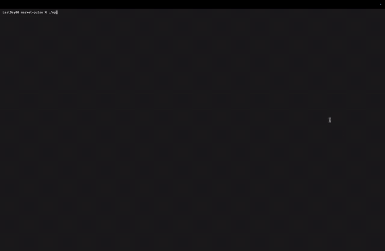

# Market Pulse

Scanner de swing-trading en TUI (terminal) pour les actions et ETF européens et américains. Conçu pour les utilisateurs de Trade Republic, mais l'outil n'a aucune intégration directe avec le compte : il calcule les opportunités, c'est l'utilisateur qui exécute les ordres manuellement.

## Démo



> **Avertissement** — Market Pulse est un outil d'aide à la décision pédagogique, pas un conseil en investissement. Aucune garantie sur la qualité des signaux. Utilisez à vos propres risques. Pas de garantie de résultat, pas de responsabilité des contributeurs.

## Fonctionnalités

- Scan de ~1500 tickers (S&P 500, S&P 600, Nasdaq 100, CAC 40, DAX 40, FTSE 100, FTSE MIB, IBEX 35, AEX 25, BEL 20, OMXS 30, SMI, STOXX 50, ETF UCITS).
- Indicateurs techniques (RSI, MACD, EMA, ATR, volumes…) via `pandas-ta`.
- Score transparent par somme pondérée de signaux explicables.
- Plan de trade complet : entrée, take-profit, stop-loss, ratio R/R.
- Multi-horizons : 1 jour, 1 semaine, 1 mois, 1, 3, 5, 10 ans.
- Trois modes de scoring : technique pur, blend technique/fondamental 80/20, fondamental pur.
- Cache SQLite (TTL 24h) sur les meta et fundamentals pour éviter le rate-limit yfinance.
- Filtres long / short / les deux.
- Vue détail avec graph en chandelier, ratios financiers, news.

## Prérequis

- macOS, Linux ou Windows (WSL recommandé).
- Python ≥ 3.12, < 3.14.
- [`uv`](https://docs.astral.sh/uv/) — gestionnaire de paquets et de venv ultra-rapide.
- Un terminal compatible 24-bit color (la plupart des terminaux modernes le sont).
- Connexion Internet (les données sont fetchées via yfinance).

### Installation de uv

```bash
# macOS / Linux
curl -LsSf https://astral.sh/uv/install.sh | sh

# Windows (PowerShell)
powershell -c "irm https://astral.sh/uv/install.ps1 | iex"

# Ou via Homebrew
brew install uv
```

## Installation

```bash
git clone https://github.com/<your-username>/market-pulse.git
cd market-pulse
./install.sh
```

Le script :

1. Vérifie que `uv` est installé.
2. Détecte si le projet est dans un dossier synchronisé (iCloud Drive, Dropbox, OneDrive). Si oui — typiquement `~/Documents` sur macOS — il place le venv dans `~/Library/Caches/market-pulse/venv` plutôt que dans `.venv/`. Sans ça, iCloud peut évincer des fichiers du venv et casser les imports (numpy, pandas…).
3. Installe toutes les dépendances.
4. Applique le workaround macOS pour le flag `UF_HIDDEN` sur les `.pth` (ignorés par Python 3.12.5+).
5. Vérifie que les imports clés (`pandas`, `numpy`, `pandas_ta`, `yfinance`, `market_pulse`) fonctionnent. En cas d'install corrompue, retente automatiquement avec un cache uv propre.

Options :

```bash
./install.sh --clean   # supprime l'ancien venv avant l'install
./install.sh --nuke    # supprime venv ET cache uv (recours en cas de cache uv corrompu)
./install.sh --dev     # installe aussi pytest et les dépendances de test
```

Alternativement via Make :

```bash
make install        # standard
make install-dev    # avec dépendances de test
make clean          # nettoie venv (local et externe) + caches + builds
```

## Lancement

```bash
./mp
# ou
make run
```

Le wrapper `./mp` exporte `UV_PROJECT_ENVIRONMENT` vers le venv hors-iCloud puis appelle `uv run market-pulse`. **N'utilisez pas `uv run market-pulse` directement** si le projet est sous iCloud Drive : sans la variable, uv recréera un venv local dans iCloud et le bug d'éviction reviendra.

Si votre projet n'est PAS dans un dossier synchronisé (par ex. `~/dev/market-pulse`), `./install.sh` crée un `.venv` classique et `uv run market-pulse` fonctionne normalement.

Au premier lancement, le scan prend ~2-5 min selon la taille de l'univers et la vitesse de votre connexion. Les lancements suivants sont plus rapides grâce au cache SQLite (TTL 24h dans `~/.market-pulse/cache.db`).

## Utilisation

### Écran scanner (vue principale)

Liste triée par score décroissant des opportunités détectées.

| Touche | Action |
| --- | --- |
| `↑` `↓` | Naviguer dans la liste |
| `Enter` | Ouvrir la vue détail |
| `/` | Recherche par ticker ou nom |
| `Esc` | Effacer la recherche |
| `r` | Relancer un scan (force refresh) |
| `Ctrl+P` | Ouvrir la palette de commandes |
| `q` | Quitter |

### Palette de commandes (`Ctrl+P`)

Toute la configuration passe par la palette : tapez quelques caractères pour filtrer, puis `Enter`.

**Horizon** — détermine la fenêtre des signaux et donc la durée typique du trade :

- `1d` — intraday / day trading
- `1w` — swing court (défaut)
- `1m` — swing moyen
- `1y`, `3y`, `5y`, `10y` — investissement / buy & hold

**Filtre direction** : `LONG`, `SHORT`, ou les deux.

**Ratio R/R minimum** : 1.5, 2.0 (défaut), 2.5, 3.0.

**Mode de scoring** :

- `Technique pur` — signaux purement techniques.
- `Blend tech + fonda 80/20` — top 20 re-scoré en mixant 80% technique + 20% fondamentaux.
- `Fondamental pur` — uniquement les ratios financiers (PE, ROE, marge, croissance…). Plus lent (~1-3 min de plus pour enrichir 200 tickers). Adapté à l'investissement long terme.

**Actions globales** :

- `Relancer le scan (force refresh)` — bypass complet du cache, re-fetch toutes les bars.
- `Afficher les paramètres courants` — toast avec horizon, R/R min, direction, mode.

Les changements d'horizon, R/R min ou mode de scoring déclenchent un rescan automatique.

### Vue détail (`Enter` sur une opportunité)

Affiche le plan de trade, les indicateurs, les fondamentaux, le graph en chandelier ASCII, et les news.

| Touche | Action |
| --- | --- |
| `f` | Charger / rafraîchir les données yfinance pour ce ticker |
| `g` | Ouvrir le chart en plein écran |
| `Esc` | Retour au scanner |
| `q` | Quitter |

## Configuration et fichiers

| Fichier | Rôle |
| --- | --- |
| `~/.market-pulse/cache.db` | Cache SQLite (meta + fundamentals + bars). Suppression possible pour forcer un re-fetch complet. |
| `~/.market-pulse/settings.json` | Préférences utilisateur (horizon, R/R min, filtre, mode). Modifié via la palette. |

Aucun secret, token ou clé API n'est nécessaire — yfinance est gratuit et ne demande pas d'authentification.

## Tests

```bash
make test
# ou
uv run --extra dev pytest -q
```

## Dépannage

### `ModuleNotFoundError: No module named 'market_pulse'` au lancement

Bug connu sur macOS avec Python 3.12.5+ : le filesystem marque parfois les fichiers `.pth` du venv avec le flag `UF_HIDDEN`, et Python 3.12.5+ ignore les `.pth` "hidden" depuis cette version. Le script `install.sh` corrige automatiquement le flag, mais si vous avez créé le venv autrement (par exemple via `uv sync` direct), le bug peut surgir.

Solution :

```bash
./install.sh --clean
```

Ou manuellement :

```bash
chflags nohidden .venv/lib/python*/site-packages/*.pth
```

### `AttributeError: module 'pandas' has no attribute 'DataFrame'` (ou `numpy`, `pandas_ta`…)

**Cause la plus fréquente sur macOS : iCloud Drive synchronise `~/Documents`** et évince périodiquement des fichiers du venv. Les `.dist-info` restent mais les modules disparaissent — d'où l'erreur. La solution est de placer le venv hors d'iCloud :

```bash
./install.sh --clean
./mp                  # ne plus utiliser `uv run market-pulse` directement
```

`install.sh` détecte automatiquement les chemins sous `~/Documents`, `~/Desktop`, `~/Library/Mobile Documents`, ainsi que les dossiers Dropbox / OneDrive, et place le venv dans `~/Library/Caches/market-pulse/venv`.

Variantes :

- Pour vérifier si iCloud sync est actif sur Documents :
  ```bash
  defaults read com.apple.finder FXICloudDriveDocuments
  ```
  `1` = synchronisé, `0` = non.
- Pour désactiver la sync de Documents (System Settings → Apple ID → iCloud → Drive → Documents).
- Ou déplacer le projet hors d'iCloud (par ex. `~/dev/market-pulse`).

**Cause secondaire** : cache uv corrompu (un paquet a son `.dist-info` mais pas son module dès la première install). Recours :

```bash
./install.sh --nuke
```

Cette option supprime venv **et** cache uv (`~/.cache/uv`) avant de tout réinstaller. `install.sh` détecte aussi automatiquement ce cas et retente une fois.

### Rate limit yfinance

yfinance peut renvoyer des `429 Too Many Requests` si trop de tickers sont fetchés trop vite. Le cache SQLite (TTL 24h) limite ce risque. En cas de souci, attendre quelques minutes ou réduire la concurrence en éditant `max_concurrency` dans `src/market_pulse/__main__.py`.

### Le scan est très lent

Mode `fundamental` enrichit jusqu'à 200 tickers et ajoute 1-3 min. Si vous n'avez pas besoin des fondamentaux, repassez en `Technique pur` via la palette.

### Les graphiques s'affichent mal

Les charts en chandelier nécessitent un terminal 24-bit color avec une largeur minimale de ~120 colonnes. Si l'affichage est cassé, agrandissez la fenêtre, ou utilisez un terminal moderne (iTerm2, Alacritty, Wezterm, Kitty, Windows Terminal).

## Architecture

```
src/market_pulse/
├── __main__.py          point d'entrée CLI
├── config.py            chemins et préférences utilisateur
├── data/                providers (yfinance), cache SQLite, modèles
├── engine/              indicateurs, signaux, scoring, plan de trade, scanner
├── ui/                  app Textual, écrans, widgets, palette
└── universe/            CSV des univers (S&P 500, CAC 40, etc.) + loader
```

## Licence

[MIT](LICENSE).

## Disclaimer financier

Cet outil est fourni "tel quel" à des fins éducatives. Les signaux générés ne constituent **pas** un conseil en investissement. Les marchés financiers comportent un risque de perte en capital. Les performances passées ne préjugent pas des performances futures. Toute décision d'investissement relève de la seule responsabilité de l'utilisateur.
